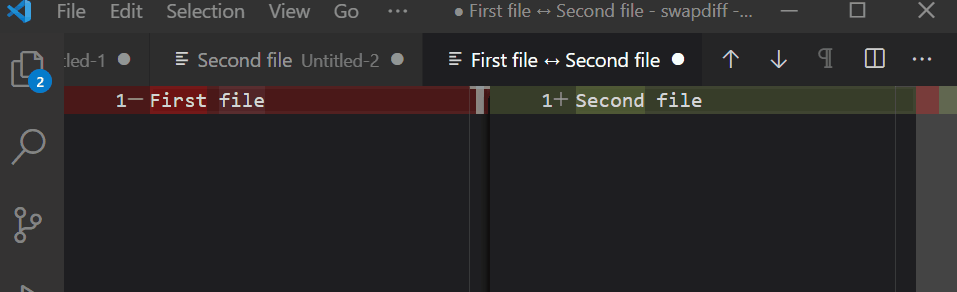

# swapdiff Extension for Visual Studio Code

Quickly swaps out documents open in diff mode

## Install

- VS Code Marketplace: <https://marketplace.visualstudio.com/items?itemName=j4k0xb.swap-diff>
- Open VSX: <https://open-vsx.org/extension/j4k0xb/swap-diff>

## Commands

- `extension.swap-diff.swapdiff`: Swap diff documents

## Settings

- `swap-diff.closePreviousDiff`: Close previous diff after switching
